# On Windown Subsystem (wsl)/Linux/Mac

## 1. Requirement:
Go version: ≤ @1.18.

    https://go.dev/dl
    https://dev.to/deadwin19/how-to-install-golang-on-wslwsl2-2880

Nodejs version: @16.0.0 - @18.0.0.

    https://nodejs.org/en/download/

Git(Optional).
Solidity: 0.8.13

    npm install -g solc@0.8.13

Truffle:

    https://trufflesuite.com/truffle/

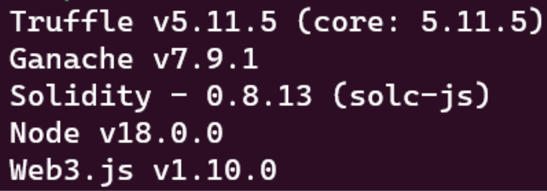

Polygon-edge:

    https://github.com/0xPolygon/polygon-edge/tree/v0.6.1
    $ git clone https://github.com/0xPolygon/polygon-edge/tree/v0.6.1
    $ cd polygon-edge-v0.6.1/
    $ go build -o polygon-edge main.go
    $ sudo mv polygon-edge /usr/local/bin

## 2. Initializing data directories and validator keys for the nodes

    $ polygon-edge secrets init –data-dir test-chain-1
    $ polygon-edge secrets init –data-dir test-chain-2
    $ polygon-edge secrets init –data-dir test-chain-3
    $ polygon-edge secrets init –data-dir test-chain-4

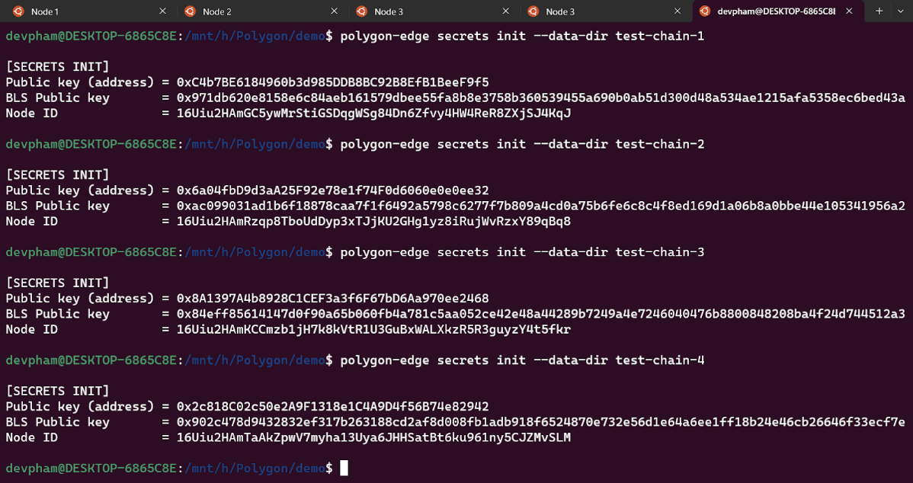

- This will create a data directory for node one named “test-chain-1”.
- Create parameters:
• Validator key
• BLS public key
• Node ID
- Same for test-chain 2,3,4.
- Flag explanation:
“–data-dir”: sets the name of the folder for node n.

## 3. Create a connection string for defining a bootnode

**multiaddr**: It is a convention for encoding multiple layers of addressing information into a single path structure.

Multiaddr format is as follows:

    "/ip4/<ip_address>/tcp/<port>/p2p/<node_id>"

Here ip address is 127.0.0.1, and the port will be 10001 in the case of node 1. The node id is obtained while initializing the data directories.

So the complete multiaddr string for **node 1** will look like:

    "/ip4/127.0.0.1/tcp/10001/p2p/16Uiu2HAmGC5ywMrStiGSDqgWSg84Dn6Zfvy4HW
    4ReR8ZXjSJ4KqJ"

For **node 2**:

    "/ip4/127.0.0.1/tcp/20001/p2p/16Uiu2HAmRzqp8TboUdDyp3xTJjKU2GHg1yz8iR
    ujWvRzxY89qBq8"

## 4. Generating genesis file with all 4 nodes as validators and 2 nodes as bootnodes

The basic command to generate the genesis file:

    $ polygon-edge genesis
      -consensus ibft
      -ibft-validators-prefix-path test-chain-
      -bootnode <01_multiaddr>
      -bootnode <02_multiaddr>
      -premine<public_key_address>:1000000000000000000000

Flag explanation:
- “–consensus ibft”: an Istanbul Byzantine Fault Tolerance (IBFT) consensus proto-
col.
- “–ibft-validators-prefix-path test-chain-”: Set the prefix folder path to the one spec-
ified, which ibft polygon can use this directory is used to find the consensus folder
where the validator’s private key is kept.
- “–bootnode”: multiAddr URL for p2p discovery bootstrap. This flag can be used
multiple times
- “–premine”: The premined accounts and balances
    (format: \<address>:\<balance>)
    Default premined balance: 0xD3C21BCECCEDA1000000

The complete command will look like:
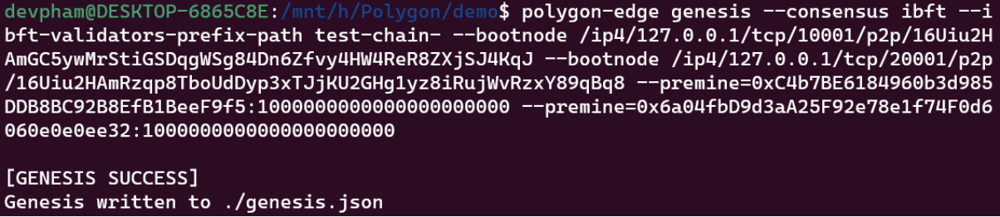

## 5. Run all nodes

For node 1:

    $ polygon-edge server --data-dir ./test-chain-1 --chain genesis.json --grpc-address :10000 --libp2p :10001 --jsonrpc :10002 --seal

For node 2:

    $ polygon-edge server --data-dir ./test-chain-2 --chain genesis.json --grpc-address :20000 --libp2p :20001 --jsonrpc :20002 --seal

For node 3:

    $ polygon-edge server --data-dir ./test-chain-3 --chain genesis.json --grpc-address :30000 --libp2p :30001 --jsonrpc :30002 --seal

For node 4:

    $ polygon-edge server --data-dir ./test-chain-4 --chain genesis.json --grpc-address :40000 --libp2p :40001 --jsonrpc :40002 --seal

Flag explanation:
- ”–-seal”: This means that the node being started will participate in the block ceiling.
- ”–-chain”: The chain flag specifies with Genesis file should be used for chain configuration.

## 6. Connecting with metamask

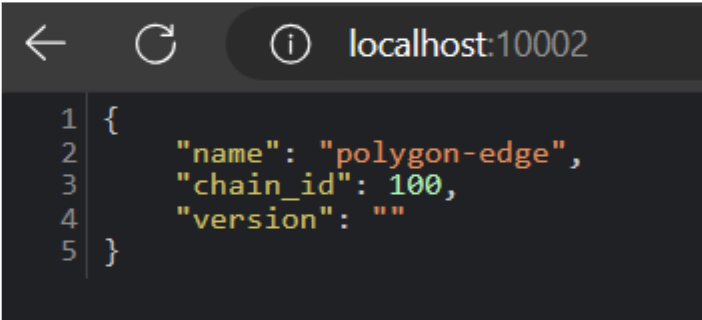

Check JSON-RPC

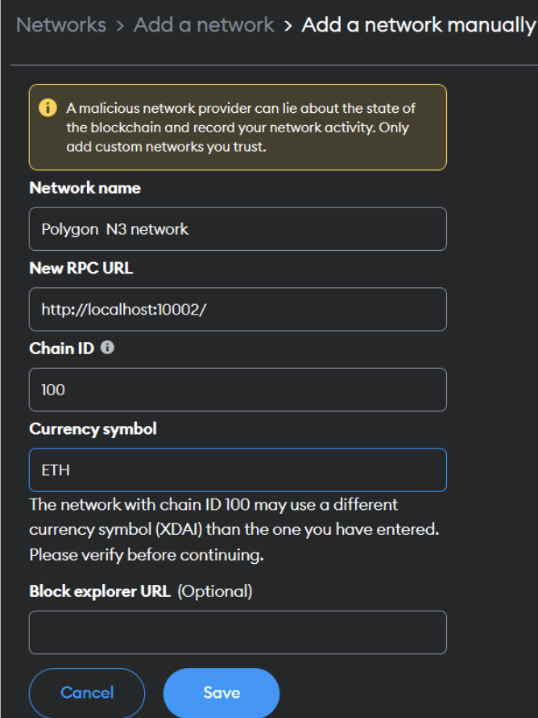

Add newwork in metamask

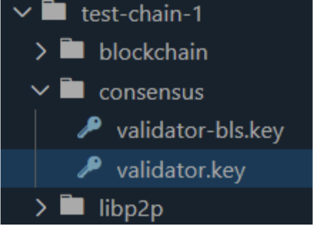
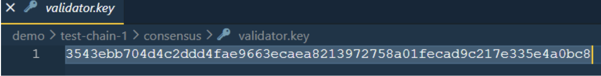
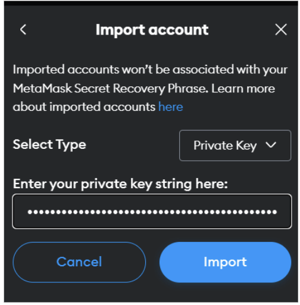

import account (Node 1)

## 7. Network Configuration

- Example config:

        const HDWalletProvider = require('@truffle/hdwallet-provider');
        const privateKey = "3543ebb704d4c2ddd4fae9663ecaea8213972758a01fecad9c217e335e4a0bc8";
        module.exports = {
        networks: {
                edgechain: {
                provider: () => new HDWalletProvider(privateKey, "http://localhost:10002/"),
                network_id: "*",
                chain_id: 100,
            }
        },
        mocha: {
            // timeout: 100000
        },
        // Configure your compilers
        compilers: {
            solc: {
                version: "0.8.13",      // Fetch exact version from solc-bin
            }
        }
        };

**Note:**
- Run “npm i @truffle/hdwallet-provider” to import library.
- privatekey is validator.key in Node1.

## 8. Creating ERC20 Tokens

We will initialize the truffle project with this command:

    truffle init

In the **contracts folder** we will create a smart contract

Run the command: 

    npm i @openzeppelin/contracts 

File \<yournameTokens>.sol:

    // SPDX-License-Identifier: MIT
    pragma solidity ^0.8.0;

    import "@openzeppelin/contracts/token/ERC20/ERC20.sol";

    contract TDTcoin is ERC20("TDTcoin", "TDT") {
        constructor (){
            _mint(msg.sender, 1000*10**18);
        }
    }

In the **migrations folder** we will create a file **1_deploy_contracts.js** as follows:

    const ShipmentContract = artifacts.require('ShipmentContract');
    module.exports = function (deployer){
        deployer.deploy(ShipmentContract)
    }

Next, we will run the compile and migrate commands to deploy the above smart contract:

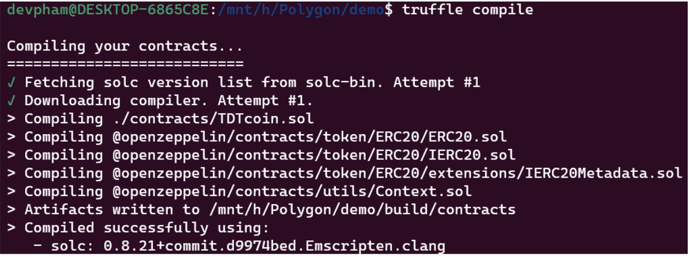

Compile contract

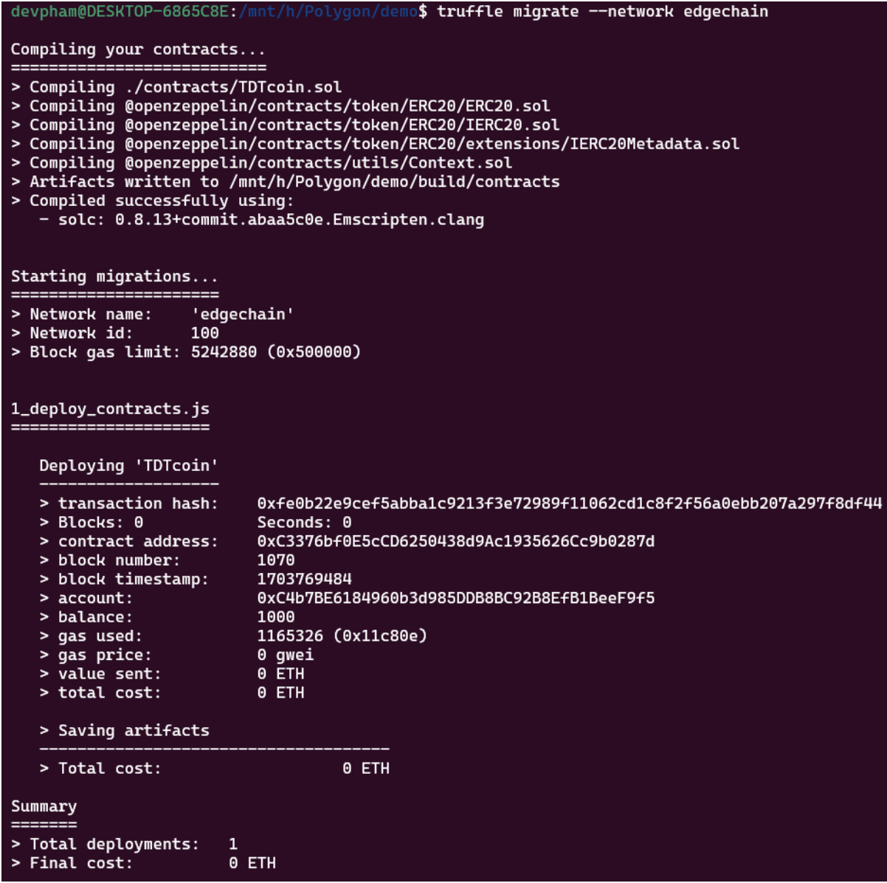

Deploy contract

As we have seen, when deploying, there will be a contract address. We will take that address and import the contract into the metamask:

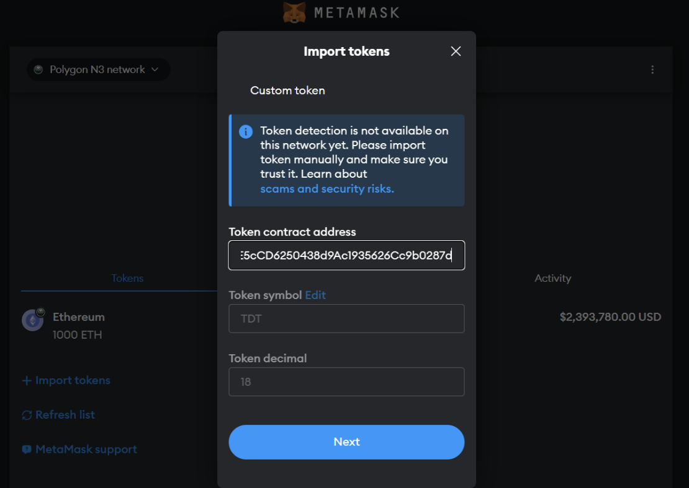

Import token

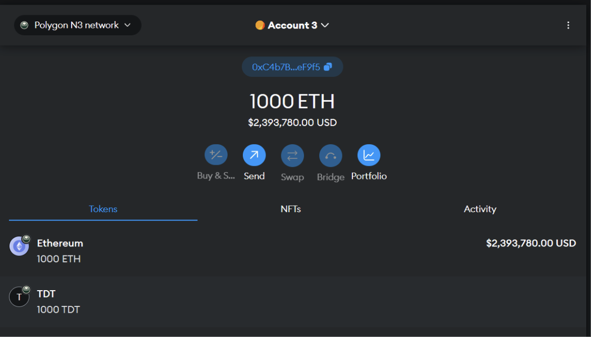

Result

## 9. Network stress testing

Load board:
- Transactions: which sends a specific amount of fund transactions.
- Deploy: which deploys the smart contract with each transaction, the first method that is sending fund transfer transactions is the default method.
- We need have the public and private key of the account in which we have premined the balance while creating the Genesis block.

When we set environment variables and run loadbot, the result here:

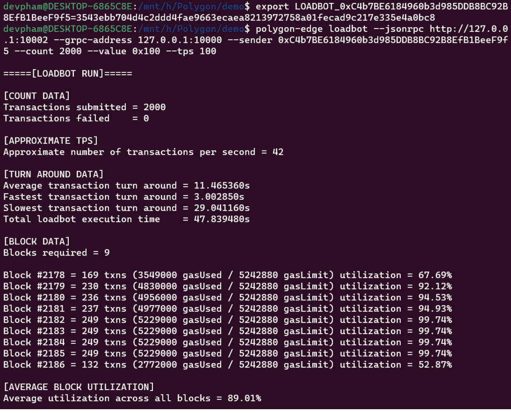

Test network

## 10. Summary the results of building private custom blockchain

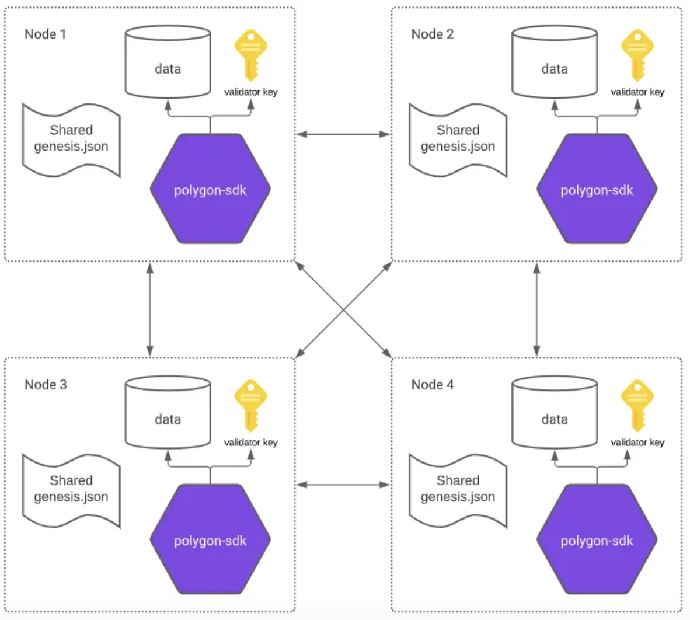

## 11. Deploy shipment smart contracts in simple logistics

First , create file ShipmentContract.sol in folder contracts:

    // SPDX-License-Identifier: MIT
    pragma solidity ^0.8.0;

    // Khai báo contract
    contract ShipmentContract {
        // Struct để lưu trữ thông tin của một lô hàng
        struct Shipment {
            uint256 trackingNumber;
            address sender;
            address receiver;
            string status;
            string location;
        }

        // Mapping để ánh xạ tracking number với thông tin của lô hàng
        mapping(uint256 => Shipment) public shipments;

        // Function để tạo một lô hàng mới
        function createShipment(uint256 _trackingNumber, address _receiver, string memory _status, string memory _location) public {
            // Kiểm tra xem lô hàng đã tồn tại chưa
            require(shipments[_trackingNumber].trackingNumber != _trackingNumber, "Shipment already exists");

            // Tạo một lô hàng mới với thông tin người gửi, người nhận, số theo dõi, trạng thái và vị trí
            shipments[_trackingNumber] = Shipment(_trackingNumber, msg.sender, _receiver, _status, _location);
        }

        // Function để cập nhật trạng thái và vị trí của lô hàng
        function updateShipment(uint256 _trackingNumber, string memory _status, string memory _location) public {
            // Kiểm tra xem lô hàng đã tồn tại chưa
            require(shipments[_trackingNumber].trackingNumber == _trackingNumber, "Shipment does not exist");

            // Kiểm tra xem người gọi function có quyền cập nhật không
            require(msg.sender == shipments[_trackingNumber].sender || msg.sender == shipments[_trackingNumber].receiver, "You are not authorized");

            // Cập nhật trạng thái và vị trí của lô hàng
            shipments[_trackingNumber].status = _status;
            shipments[_trackingNumber].location = _location;
        }

        // Function để lấy thông tin của một lô hàng dựa trên số theo dõi
        function getShipment(uint256 _trackingNumber) public view returns (uint256, address, address, string memory, string memory) {
            // Kiểm tra xem lô hàng đã tồn tại chưa
            require(shipments[_trackingNumber].trackingNumber == _trackingNumber, "Shipment does not exist");

            // Trả về thông tin của lô hàng
            return (
                shipments[_trackingNumber].trackingNumber,
                shipments[_trackingNumber].sender,
                shipments[_trackingNumber].receiver,
                shipments[_trackingNumber].status,
                shipments[_trackingNumber].location
            );
        }
    }

Then, we run the command to deploy this contract:

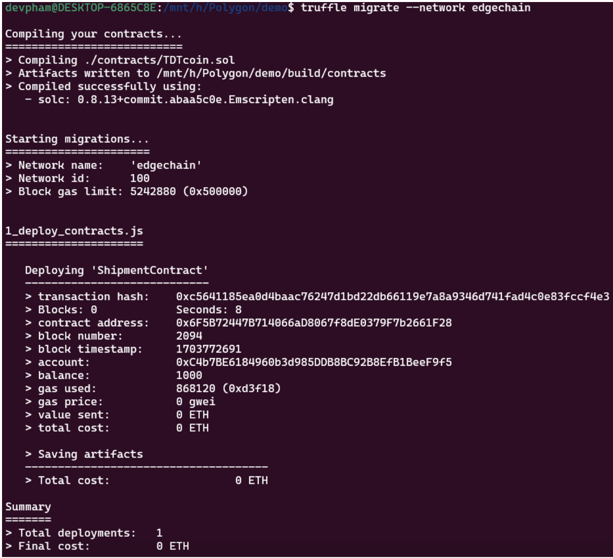

Deploy Shipment Contract

Next, access truffle’s console to test the smart contract:

    $ truffle console --network edgechain

    let instance = await ShipmentContract.deployed()
    await instance.createShipment(001,"0x26BFdAA8d340B879219727f036981FedaE947518","Dang gui","Sai Gon")
    await instance.getShipment(001)
